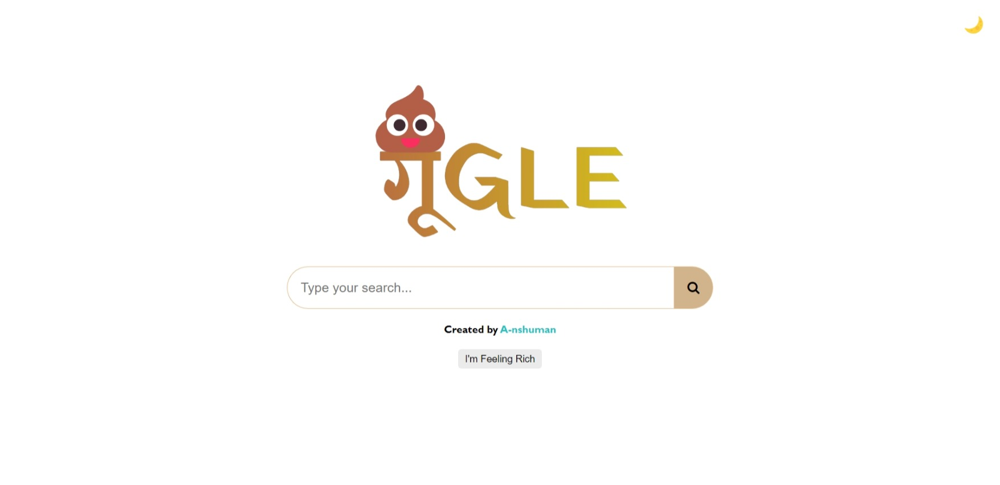

# [गू GLE](https://gu-gle.netlify.app/)

)

A playful replica of the Google search page, creatively named "[गू GLE](https://gu-gle.netlify.app/)", designed for fun and coding practice.

## Features
- User interface resembling the Google search page.
- Search functionality with results displayed.
- A playful and unique theme for coding fun.
- Toggle dark theme

