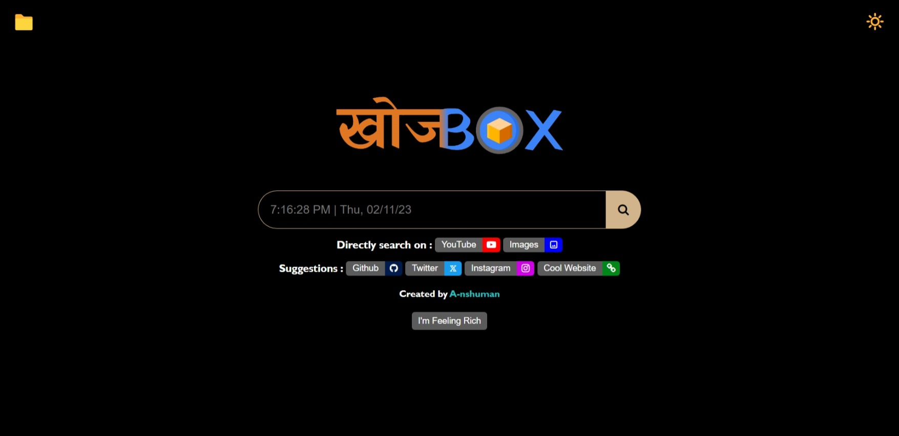

# [खोजBOX](https://khoj-box.netlify.app/)

)

A playful replica of the Google search page, creatively named "[खोजBOX](https://khoj-box.netlify.app/)", designed for fun and coding practice.

## Features
- User interface resembling the Google search page.
- Search functionality with results displayed.
- A playful and unique theme for coding fun.
- Toggle dark theme.
- Empty searchbar shows Time and Date.
- Folder which contains my other projects.

